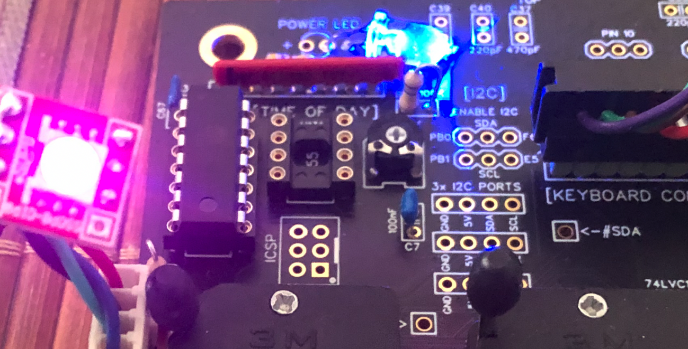
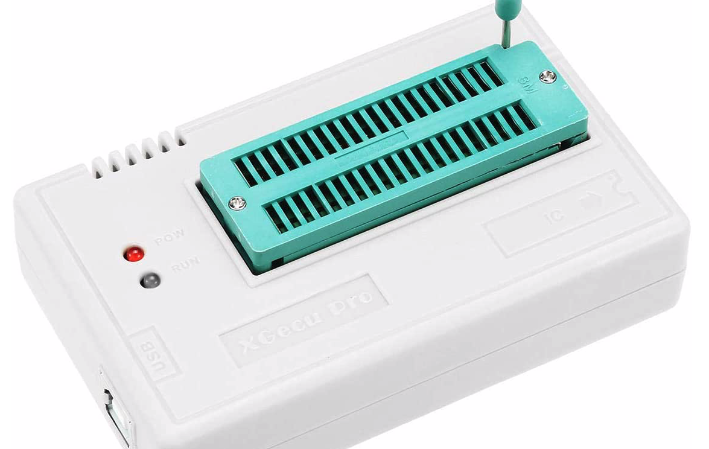

# Restore Switch (Tuning Board, Kernal/Basic inside Winbond 27E257)

changes and new features (June2021):

    - power on reset added, changed PIN defnitions for PlatformIO, typos 

    - a manual reset WITHOUT switching Kernal can be performed by pressing the Restore key for 800 - 2000 ms

    - true WHITE LED multiplexing added during RESET procedure

Programming ATTiny84 to act as kernel switch for the C64 Tuning Board to use the Winbond EEPROM W27E257, where Vpp and A14 are switched:

  

 ATtiny 84, internal 8MHz
 
 lfuse E2
 hfuse D4
 efuse FF

  

Prepare the controller: only once to set the fuses (internal 8Mhz, BOD Level 4.3V, EESAVE):
---------------------------------------------
(More Infos: http://eleccelerator.com/fusecalc/fusecalc.php?chip=attiny84)

<code>
avrdude -p attiny84 -c usbtiny -U lfuse:w:0xe2:m -U hfuse:w:0xd4:m
</code>

or:
<code>
minipro -p attiny84 -w fuses.bin -c config
</code>

in case You prefer this programmer TL866 

  

Then flash the firmware:

<code>
avrdude -p attiny84 -c usbtiny -U flash:w:"firmware.hex":i -v -V -u
</code>

or
<code>
minipro -p attiny84 -w firmware.hex
</code> 

Have fun ;-)

cassy

