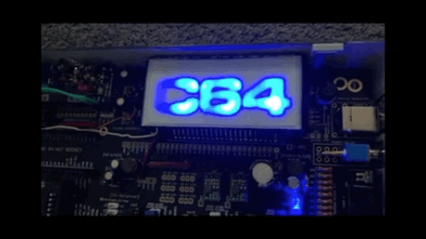

# Restore Switch (Tuning Board, Kernal/Basic inside Winbond 27E257)

complete makeover of the hardware and code, old version is in DIR "RGB" now

    - Hardware: replacing the RGB-LED by WS2812-stripe (here 16 LEDs), Data PIN2 on Tiny84

    - Firmware: 

    - a manual reset WITHOUT switching Kernal can be performed by holding the Restore key 
      for 800 - 2000 ms, as a feedback, LEDs are blinking "white" twice to indicate  800ms. 

    - during RESET procedure, LEDs are FlAsHiNg "white"

    - Holding the restore key for more then 2s -> switching the kernel, LEDs are changing their colors

    - After 6s, a "Show Program" pattern is shown on all 16 LEDs for entertainment
    - 1st pattern:  moving rainbow 
    - 2nd pattern:  analog VU Meter of SID sounds 
    - 3rd pattern:  chasing lights  
    - 4th pattern:  twinkle little star  on a blue night sky

    - changing the patterns by "double tapping"  the restore key 

  

Programming ATTiny84 to act as kernel switch for the C64 Tuning Board to use the Winbond EEPROM W27E257, where Vpp and A14 are switched:

  

 ATtiny 84, internal 8MHz
 
 lfuse E2
 hfuse D4
 efuse FF

Prepare the controller: only once to set the fuses (internal 8Mhz, BOD Level 4.3V, EESAVE):
---------------------------------------------
(More Infos: http://eleccelerator.com/fusecalc/fusecalc.php?chip=attiny84)

<code>
avrdude -p attiny84 -c usbtiny -U lfuse:w:0xe2:m -U hfuse:w:0xd4:m
</code>

or:

<code>
minipro -p attiny84 -w fuses.bin -c config
</code>

Then flash the firmware:

<code>
avrdude -p attiny84 -c usbtiny -U flash:w:"firmware.hex":i -v -V -u
</code>

or

<code>
minipro -p attiny84 -w firmware.hex
</code> 

Have fun ;-)

cassy

